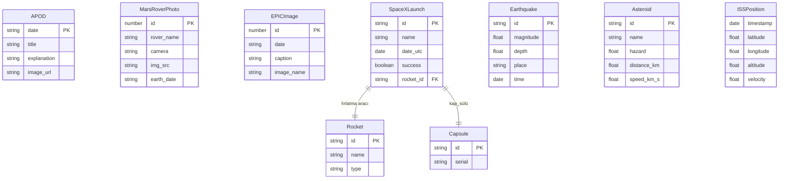
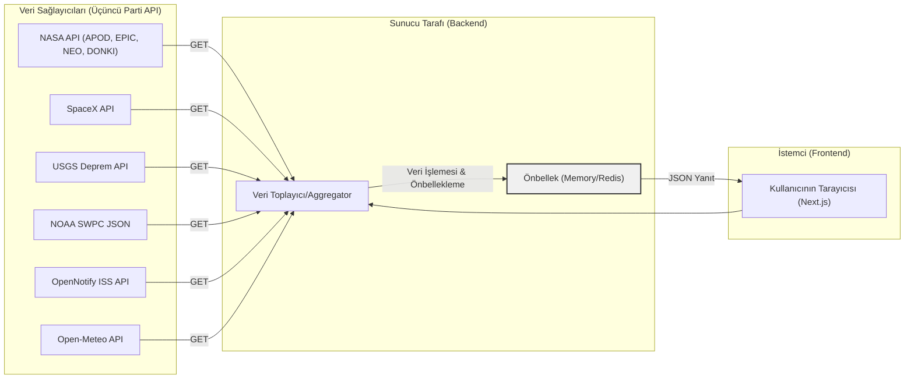

# COSMOS — Gezegen Zekası Dashboard’u

**Yönetici Özeti:** *COSMOS*, uzaydaki ve dünyadaki güncel bilimsel gelişmeleri tek bir platformda toplayan premium bir web uygulamasıdır. NASA, SpaceX, USGS ve NOAA gibi kurumların ücretsiz API’lerinden alınan verilerle günlük astronomi görselleri, uzaydaki fırlatma ve asteroid bilgileri, dünya depremleri, aurora tahminleri gibi bileşenler sunar. Gerçek zamanlı güncellemeler, etkileşimli grafikler ve OpenAI destekli “Günlük Gezegen Raporu” ile zenginleştirilmiş bu uygulama, portföy kalitesinde bir ürün olarak tasarlanacaktır.  

---

## Proje Vizyonu ve Hedefleri

- **Birleşik Bilim Portalı:** Uzay (astronomi ve uzay görevleri) ile Dünya (deprem, hava durumu) verilerini tek bir kullanıcı arayüzünde birleştirir.  
- **Kullanıcı Çekiciliği:** Her gün ziyaret edilip incelenmek istenecek kadar ilgi çekici, dinamik bir **bilim dashboard’u** sunar. Tasarım Apple, NASA ve modern minimalist yaklaşımlardan esinlenerek temiz, dinamik ve etkileşimli olmalıdır.  
- **Eğitsel ve Etkileşimli:** Sadece veri göstermeyip, kullanıcıların etkileşime girebileceği (detay modalları, favorilere ekleme, arama, bildirimler) bir deneyim sunar. Ayrıca her günün özetini AI ile üreterek kullanıcıyı sürekli bilgilendirir.  
- **Portföy Değeri:** Bu proje, geliştiricilerin portföyünde öne çıkacak; işe alım yetkililerini etkileyecek, yenilikçi ve sofistike bir yapıya sahip olacaktır.

---

## MVP ve Kapsam

**MVP (Minimum Uygulanabilir Ürün):**  
- **NASA APOD Bölümü:** Günün uzay fotoğrafı ve açıklaması.  
- **Deprem Listesi:** Son dönemdeki önemli depremlerin listesi veya harita görünümleri (USGS verisi).  
- **Arayüz Temeli:** İki sütunlu (Uzay / Dünya) basit bir paneller dizisi, responsif ve karanlık tema.  
- **Teknolojik Altyapı:** Next.js (React), TailwindCSS, basit API entegrasyonu.  
- **Deployment:** İlk versiyon Vercel veya benzeri platformda yayına alınır.  
- **Zaman:** Tahmini 1-2 haftalık geliştirme.

**Beta (İkinci Faz):**  
- **SpaceX Entegrasyonu:** En son ve yaklaşan fırlatış bilgileri, roket görselleri.  
- **ISS İzleyici:** Canlı ISS pozisyonu haritada.  
- **NOAA Aurora ve Güneş Aktivitesi:** Aurora oval tahmini, K-index verileri.  
- **Open-Meteo Hava Durumu:** Kullanıcının konumuna göre hava durumu ve gün doğumu/batımı.  
- **Kullanıcı Özelleştirmeleri:** Hangi bölümlerin görüneceği ayarlanabilir.  
- **Dünya Haritası Katmanları:** Depremler haritada işaretlenir.  
- **Zaman:** Ek ~2-3 hafta.

**1.0 (Üretimsel Sürüm):**  
- **Yapay Zeka Özeti:** OpenAI kullanarak günlük “Gezegen Raporu” üretimi.  
- **Bildirimler:** Yeni APOD, büyük depremler, fırlatışlar için tarayıcı bildirimleri.  
- **Favoriler ve Arama:** Kullanıcı yerel depolamada favori içerik kaydedebilir, gezegen/misyon/deprem arama motoru.  
- **Sosyal Paylaşım:** NASA görselleri veya günün olaylarını sosyal medyada paylaşma entegrasyonu.  
- **QA ve Testing:** Birim, entegrasyon ve uçtan uca testlerle ürün güvenilir hale getirilir.  
- **Zaman:** Ek ~2-3 hafta (toplam yaklaşık 80 saatlik çaba).

---

## Teknoloji Yığını

- **Frontend:** Next.js 15 (App Router), React 19, TypeScript, TailwindCSS, shadcn/ui bileşenleri, Framer Motion animasyonları.  
- **State Yönetimi:** React Query (TanStack Query) önbellekleme için; durum yönetimi için Zustand.  
- **Backend:** Next.js API Routes veya Express (Node.js). Serverless işlevler ya da tam Node sunucusu (Vercel/Fly ile).  
- **Veri Katmanı:** API sorguları için arka uçta veri toplama ve önbellekleme. Bellek içi veya Redis cache.  
- **Veritabanı:** Kullanıcı giriş yok, sadece favoriler için localStorage planlı – sunucu tarafında veritabanına ihtiyaç yok. (Geçici ise Redis/Memory Cache kullanılabilir.)  
- **Önbellekleme & CDN:** Next.js ISR (Incremental Static Regeneration) veya SWR caching. CDN: Vercel/Cloudflare üzerinden statik içerik.  
- **CI/CD:** GitHub Actions veya Vercel entegrasyonu ile otomatik test ve deploy.  
- **Monitoring:** Log toplama (Sentry, LogRocket), performans metrikleri (Vercel Analytics, Lighthouse takibi).  

---

## API Envanteri ve Detayları

| API Kaynağı         | Endpoint Örnekleri                                                                                                     | Yetkilendirme    | Limitleme (Rate Limit)            | Notlar                                                                                                                                                               |
|---------------------|-------------------------------------------------------------------------------------------------------------------------|------------------|----------------------------------|---------------------------------------------------------------------------------------------------------------------------------------------------------------------|
| **NASA APOD**       | `GET https://api.nasa.gov/planetary/apod?api_key=YOUR_KEY&date=2026-07-18`                                              | API Key          | 1,000 istek/saat (kişisel anahtarla)  | Günün astronomi fotoğrafı. `DEMO_KEY` (deneme) 30/saat, gerçek anahtar 1000/saat. JSON döner: tarih, başlık, açıklama, resim URL’si.                     |
| **NASA Mars Rover** | `GET https://api.nasa.gov/mars-photos/api/v1/rovers/curiosity/photos?sol=1000&api_key=YOUR_KEY`                       | API Key          | 1,000 istek/saat   | Curiosity/Opportunity/Sprit roverlarının Mars’ta çektiği görüntüler. Parametre: `sol` (Mars günü) veya `earth_date`. Her öğe: fotoğraf URL’si, kamera, tarih vb.       |
| **NASA EPIC**       | `GET https://api.nasa.gov/EPIC/api/natural?api_key=YOUR_KEY`                                                           | API Key          | 1,000 istek/saat   | Dünya’nın doğal renkli görüntüleri. Tekil bir tarihteki tüm resim metadata’sını döner. Örnek: en güncel doğal renkli resimler için `natural`.                 |
| **NASA NEO (Asteroid)** | `GET https://api.nasa.gov/neo/rest/v1/feed?start_date=2026-07-18&end_date=2026-07-18&api_key=YOUR_KEY`           | API Key          | 1,000 istek/saat   | Yakın Dünya Cisimleri. Verilen tarih aralığında göktaşı geçişleri. JSON içinde `near_earth_objects` listesi: her biri için çap, hız, yakınlık vb. bilgiler.            |
| **NASA DONKI**      | `GET https://api.nasa.gov/DONKI/FLR?startDate=2026-07-18&endDate=2026-07-18&api_key=YOUR_KEY`                          | API Key          | 1,000 istek/saat   | Güneş aktiviteleri. Örn. FLR (güneş patlamaları), CME (koronal kütle atımı), GST (kuvvetli güneş fırtınaları). JSON listesi.                                          |
| **SpaceX API**      | `GET https://api.spacexdata.com/v5/launches/latest`  <br>`GET https://api.spacexdata.com/v4/launches/upcoming`           | Yok (özgür)      | Yok (public, belirsiz)           | Roket, fırlatma verileri. En son fırlatma (v5) ve yaklaşan (v4) bilgileri. Ayrıca `<hostname>/v4/rockets`, `/capsules`, `/launchpads`. Kimlik doğrulama gerektirmez. |
| **USGS Depremler**  | `GET https://earthquake.usgs.gov/fdsnws/event/1/query?format=geojson&minmagnitude=5&starttime=2026-06-18`              | Yok (özgür)      | Yok (ücretsiz)                   | Dünya genelinde son depremler. GeoJSON döner. Her depremde id, koordinatlar, şiddet, derinlik, saat vb. alanlar var.                                      |
| **Open Notify (ISS)** | `GET http://api.open-notify.org/iss-now.json`                                                                       | Yok (özgür)      | Yaklaşık 1 isteği/5 saniye önerilir | Uluslararası Uzay İstasyonu’nun anlık koordinatları ve zaman damgası. CORS yoksa backend proxy gerekebilir. Sürekli yenileme için 1–5 saniyede bir istek sınırı önerilir. |
| **Open-Meteo**      | `GET https://api.open-meteo.com/v1/forecast?latitude=40.7&longitude=-74.0&hourly=temperature_2m&current_weather=true`  | Yok (özgür)      | 10.000 istek/gün, 5.000/saat, 600/dak (ücretsiz) | Hava durumu verisi. Örn. `latitude`, `longitude`, `hourly=...`, `daily=...` parametreleri. Mevcut hava, günlük tahmin vb. JSON. Ücretsiz, ancak ticari olmayan kullanım için 10k/gün sınırı. |
| **NOAA SWPC (Uzay Hava)** | `GET http://services.swpc.noaa.gov/json/planetary_k_index_1m.json`<br>`GET http://services.swpc.noaa.gov/json/ovation_aurora_latest.json` | Yok (özgür) | Yok (ücretsiz)                   | NOAA Space Weather Prediction Center. Ücretsiz, JSON formatında veriler. Örneğin gezegensel K-index (geomanyetik aktivite) ve aurora tahmin matrisi. (Tüm JSON listesi [30], [32]). |

> **Kaynaklar:** NASA ve NOAA verileri ücretsiz sunulmaktadır; SpaceX ve USGS verileri de halka açıktır. Bağlantılı resimler genelde kamu malı veya NASA telifisiz lisanslıdır.

---

## Veri Modeli (ER Diyagramı)



*Not:* Yıldız işaretli ilişkiler (PK/FK) örnek amaçlıdır. AS LERK `SpaceXLaunch` ile `Rocket` arasında 1-1, `Launch` ile `Capsule` arasında many-to-many benzeri çoklu ilişki kurulabilir. APOD, Deprem, ISS pozisyonu gibi veriler diğerlerinden bağımsızdır (kendine ait birincil anahtarları vardır). Yukarıdaki ER diyagramında önemli varlıklar gösterilmiş, ilişkiler sadeleştirilmiştir. 

---

## Mimari ve Veri Akışı



- **Sunucu Tarafı Akışı:** Next.js'in API Route’ları veya Node.js arka ucu, yukarıdaki API’lerden periyodik veya isteğe bağlı olarak veri toplar. Gelen veriler işlendikten sonra JSON olarak önbelleğe (örn. Redis) kaydedilir.  
- **Önbellekleme:** Her API çağrısı sonrası sonuçlar belirli süre (örn. APOD günlük, USGS saatlik) önbellekte tutulur. Önbellek geçerliliği dolduğunda yeni istek yapılır.  
- **İstemci Tarafı Akışı:** React bileşenleri (veya Next.js Server Components) arka uçtan hazırlanmış JSON’ları alır ve görselleştirir. React Query veya SWR ile önbelleğe alınmış veriler sayfa yeniden yüklenmeden güncellenir.  
- **Arayüz Etkileşimi:** Kullanıcı arayüzü talepleri (özel ayarlar, favori ekleme) direkt tarayıcıda/localStorage’da veya basit API çağrılarıyla backend üzerinden işlenir. Arka uç ağırlıklı işlem yapmaktan kaçınılır.

---

## Bileşen Mimarisi (Frontend)

- **Layout:** Genel uygulama şablonu (Header, Footer, Ana Panel), koyu modda.  
- **Hero Bölümü (Ana Sayfa):** Dönen Dünya animasyonu, UTC saati, tarih, o günkü önemli olay, uzay temalı arka plan. (Sunucu Bileşeni veya SSR)  
- **Space Today (Uzay Bölümü):**  
  - *APOD Bileşeni:* Büyük APOD görseli, başlık, açıklama. Favorilere ekle ve paylaş düğmeleri.  
  - *SpaceX Bileşeni:* En son fırlatma kartı (isim, tarih, roket resmi). Yaklaşan fırlatış sayacı.  
  - *Uzay İstasyonu (ISS) Takip:* 3D dünya üzerinde ISS konumu, yükseklik, hız bilgisi.  
  - *Asteroit Listesi:* "Tehlikeli Asteroitler" listesi: boyut, hız, Dünya’ya uzaklık, risk seviyesi. Grafiklerle desteklenir.  
  - *Güneş Aktivitesi:* Güneş patlaması ve güneş fırtınası verileri, KP indisi, Aurora olasılığı. Animasyonlu grafikler.  
- **Earth Section (Dünya Bölümü):**  
  - *Dünya Haritası:* Leaflet + OpenStreetMap kullanılarak interaktif harita. Üzerinde deprem işaretleri.  
  - *Deprem Katmanı:* Her deprem bir daire ile gösterilir, renkler şiddete göre (yeşil- kırmızı). Tıklayınca modal: detaylı bilgiler (enlem/boylam, derinlik, zamana göre grafik).  
  - *Diğer Katmanlar (opsiyonel):* Hava durumu (ör. Open-Meteo’dan bulut örtüsü), volkan, yangın uyarısı vb. (Geliştirme aşamasında opsiyonel).  
- **Yapay Zeka Özet Bileşeni:** Her gün sayfa açıldığında arka planda OpenAI API ile “Bugünün Gezegen Raporu” oluşturulur ve metin olarak gösterilir.  
- **Arama ve Favoriler:** Üst bar’da global arama (gezegen, görev, asteroid, deprem, astronot araması) ve favori simgesi. Favoriler localStorage’da tutulur.  
- **Bildirim İzinleri:** Küçük ayarlar düğmesi ile kullanıcıdan bildirim izni istenir. Önemli olaylar (büyük deprem, yeni APOD, lansman) durumunda `Notification` API ile bildirim gönderilir.  
- **UI/UX Stili:** Google Font + system font. Renk paleti: koyu arka plan (#000-#111), vurgu renkler (uzay mavi-yeşil tonları). Cam gözenek (glassmorphism), büyük yazı tipleri, yumuşak gölgeler, kayan yıldız veya aurora animasyonu. Mobil için hamburger menü veya tek sütun geçiş.

**Durum Yönetimi:**  
- *Server Components & React Query:* API veri çekiminde Next.js Server Components (SSG/ISR) veya React Query kullanılır.  
- *Zustand:* Uygulama genelinde koyu mod, dil seçimi, arama sorgusu, favori listesi gibi durumlular.  
- *Custom Hooks:* Veri çekme (`useFetchAPOD`, `useFetchQuakes`, vb.), WebSocket veya setInterval tabanlı takip (`useISSLocation`) için.  

---

## UI/UX Özellikleri

- **Düzen:** Çift sütun (Uzay / Dünya) veya mobilde dikey panel dizilimi.  
- **Responsive:** Grid sistemi ile her ekranda (mobil, tablet, geniş ekran) uyumlu. Mobilde collapsible paneller veya sekmeler.  
- **Animasyonlar:** Geçiş efektleri (Fade-in/out), yükleme skeleton’ları, Hover durum animasyonları (butonlar parlayabilir), dünya ve yıldız arka plan hareketli. Framer Motion ve CSS ile mikro-animasyonlar.  
- **Erişilebilirlik:** Alt yazılar, img alt etiketleri. Yüksek kontrast modu, klavye odak izleme, metin büyütme desteği. Renk körlüğü için renk seçimine dikkat. Tüm önemli butonlar erişilebilir (aria-label, title).  
- **Tasarımsal Öğeler:** Şeffaf cam kartlar (glassmorphism). Büyük başlık fontları (ör. 2rem+). Minimal ikonlar (uzay temalı, Modern UI Style). Her bölüm belirgin başlık (örn. “Uzay Bugün”, “Dünya Haritası”). Parallax kaydırma efektleri sayfada hafif derinlik hissi verir.  
- **Tema:** Koyu mod varsayılan. İsteğe bağlı açık mod butonu olabilir. Yazı tipleri monospaced veya zarif sans-serif (örn. Inter, JetBrains Mono Başlıklar için).

---

## Önbellekleme, Polling ve Oran Sınırlama (Rate Limit) Yönetimi

- **APOD / EPIC / NASA NEO:** *Günlük güncelleme* – her biri günde bir kez güncellenir. Next.js ISR veya React Query `staleTime: 24h` kullanılarak önbelleklenir. Eğer NASA API erişimi kesilirse, en son önbelleklenmiş veri gösterilir (fallback).  
- **SpaceX Verisi:** Yeni fırlatış bilgisi nadiren değişir. Günlük/sağlam bir önbellekleme yeterlidir. Veya bir “güncelle” butonu eklenebilir.  
- **ISS Pozisyonu:** *Canlı veri* – her 5 saniyede bir GET isteği (Open Notify) yenilenir. (Sunucu tarafında: WebSocket veya setInterval. İstemcide: React Query / SWR polling). Daha sık istekten kaçınılır. Başarısızlık durumunda “Bağlantı kopuk” mesajı gösterilir.  
- **USGS Depremler:** Her 10-30 dakikada bir veri çekilebilir (dünyadaki yeni depremler için gecikme kabul edilebilir).  GeoJSON sorgusu önbelleğe alınır. Çok sayıda istek gerekmez (günlük ~100-200). Fallback: API hata verirse eski veriyle çalışılır.  
- **Open-Meteo (Hava Durumu):** Saatlik hava güncellemesi. 1 saatlik önbellek uygundur. Rate limit 600/dk olduğundan çok sorun yok, ancak aynı noktaya fazlaca istek göndermekten kaçınılır.  
- **NOAA SWPC:** K-index ve aurora JSON dosyaları genelde dakikada bir güncellenir. 5 dakika önbellek mantıklı. Flash dolumlarda yeniden istek. Orta seviyede istek (örneğin 5 dakikada bir) makul.  
- **Genel Rate Limit Yönetimi:** Önbellek (Redis veya Next.js ISR) ile çoğu veri verimli kullanım sağlanır. React Query’den `retry`, `onError` ile bekleme veya kullanıcıya hata mesajı eklenir. Hassas API’ler için polka-dot (exponential backoff) uygulanabilir. Kötü durum fallback’leri (önceki veri veya önceden kaydedilmiş JSON) olası.
  
---

## Yapay Zeka Özellikleri (OpenAI Entegrasyonu)

- **Günlük Özet (AI Rapor):** Her günün başında veya ilk kullanıcı isteğinde OpenAI ChatGPT-4’e şu tarz bir prompt gönderilir:  
  > *“Bugünün güneş sistemi ve dünyasıyla ilgili en önemli bilim haberlerini bir özet halinde yaz. Türkiye saatiyle 2026-07-18 tarihindeki:  
  > - Dünya’da 4.0 üstü depremler (adet ve örnek yeri)  
  > - Yaklaşan SpaceX fırlatışı var mı?  
  > - Astronomi Görseli (APOD) nedir ve açıklaması  
  > - Güneş aktivitesi (örn. KP indeksi, aurora)  
  > Özet 120 kelimeyi geçmesin.”*  
- **Örnek Özet Çıktısı:** *“Bugün dünya çapında 20’den fazla 4.0+ deprem kaydedildi; en büyüğü Alaska’da 5.2 şiddetindeydi. SpaceX’in bir sonraki Falcon 9 fırlatışı yarın planlanıyor. NASA’nın Günün Astronomi Fotoğrafı, Samanyolu’nun merkezinden bir bulutsu görüntüsü; açıklamasında yıldız oluşumu öne çıkar. Güneş aktivitesi düşük, KP indeksi 3 seviyesinde; aurora görünme olasılığı zayıf. Genel olarak sakin bir gün.”*  
- **Token ve Maliyet:** Bu tarz bir özet ~100 token (karakter başına token yaklaşık 1/4 kelime) tutabilir. ChatGPT-4 (güncel fiyatlarla ~0.03 USD/1000 token) için günde ~0.003 USD. Aylık kullanıcı başına çok düşük (yaklaşık 0.1 USD).  
- **Maliyet Düşürme:** Özet tüm kullanıcılar için aynı içerik olabilir (tüm uygulamada tek sefer oluşturulup cache’lenir). Yani bir kullanıcıya değil, günlük bir kere API çağrısı yeter. Token sayısını ~100 ile sınırlı tutarak masraf daha da düşer.  
- **Fallback / Çevrimdışı Durum:** Eğer OpenAI çağrısı başarısız olursa önceden kaydedilmiş son özet veya “Özet şu anda yüklenemiyor” mesajı gösterilir. Veya kullanıcıya API hatası bildirimi verilir.  

---

## Güvenlik, Gizlilik ve Hukuki Notlar

- **Kullanıcı Verisi:** Kullanıcıdan kişisel veri alınmıyor (sadece cihazda localStorage’da favoriler). Dolayısıyla gizlilik riski çok düşük. Varsayılan olarak hiçbir kişisel bilgi kaydedilmez.  
- **API Koşulları & Telif:** NASA, USGS ve NOAA verileri kamu malıdır ve ücretsiz olarak dağıtılır. NASA görselleri genellikle telifsizdir (NASA ve/veya fotoğrafçıya atıf gerekebilir). Uygulamada görseller kullanılırken kaynak dipnot olarak gösterilebilir. SpaceX verileri kamuya açık ama marka teliflerine dikkat (SpaceX adı kullanımı serbestçe veri içeriyor).  
- **Yasal Uyarılar:** Uygulamada aşırı dikkat gerektiren tıbbi veya navigasyon bilgisi olmaması nedeniyle kritik sorumluluk sayılmaz. Kullanıcıya “eğlence ve eğitim amaçlı bilgi” uyarısı ekleyebiliriz.  
- **Güvenlik:** Doğrulanmamış girdi alımı yok. Tüm API anahtarları sunucu tarafında saklanır (.env dosyasında). Frontend’de OpenNotify, SpaceX gibi açık API’ler kullanılır; NASA ve OpenAI anahtarları gizlenir. Content Security Policy uygulanabilir (örn. resim kaynakları).  
- **HTTPS ve CORS:** Tüm API çağrıları HTTPS üzerinden yapılacak. Open-Notify API HTTP ise sunucu proxy’si aracılığıyla çekilir. CORS ayarları Next.js veya API Gateway üzerinden düzenlenir.

---

## Test Planı

- **Birim Test (Unit Tests):** Her React bileşeni için Jest ile test yazılabilir. Örneğin APOD bileşeni: geçerli props ile resim gösterme, hata durumu mesajı testi. Fonksiyonlar için de jest testleri (örn. tarih formatlayıcılar).  
- **Entegrasyon Testleri:** React Testing Library ile sayfa renderları. Fake API (Mock Service Worker) kullanarak veri çekim testi: Deprem haritasının doğru daireler çizdiği, ISS koordinatlarının güncellendiği test edilebilir.  
- **E2E Testleri:** Cypress veya Playwright ile uygulamanın baştan sona akışı. Örneğin: “Ana sayfa açıldığında APOD kartı görünmeli ve doğru başlığı içermeli”; “Fav’a ekle butonu çalışmalı”; “Haritada bir deprem işareti tıklanınca modal açılmalı”.  
- **API İstekleri:** API entegrasyon testleri için Postman koleksiyonu veya curl testleri hazırlanabilir. Örnek komut: `curl "https://api.nasa.gov/planetary/apod?api_key=YOUR_KEY"`. Beklenen JSON formatı doğrulanır.  
- **Performans & Lighthouse:** Kritik görsel/JS paketleri küçültülerek Lighthouse’ta %90+ performans puanı hedeflenir. Responsive testleri (özelikle harita ve grafiklerin mobil uyumluluğu).

---

## Dağıtım ve Devamlılık

- **Yayın Platformu:** Next.js için ideal Vercel (ücretsiz kişisel plan uygun). Alternatifler: Fly.io, Render.com (Node.js servisi ve web).  
- **CI/CD:** GitHub Actions veya GitLab CI ile her git push’ta test ve build yapılması. Master/ana dalga merge edilince otomatik Vercel deploy.  
- **Ortam Değişkenleri (.env):** 
  - `NASA_API_KEY`, `OPENAI_API_KEY` (gizli tutulur, deploy ortamına konfigüre edilir).  
  - `NEXT_PUBLIC_` ile başlamayan tüm anahtarlar server-only.  
- **HTTPS:** Zaten platformlar otomatik SSL sağlar.  
- **Gizli Bilgiler Yönetimi:** API anahtarları gizli olarak depolanır (Vercel Dashboard veya secrets manager kullanılır). Repo’da .env örneği paylaşılır ama değerler olmadan (`.env.example`).  
- **Ölçeklenebilirlik:** İlk etapta düşük trafik varsayılır (öğrenci portföy projesi), büyük ölçek gerekmez. Yine de Next.js sunucuları horizantal scale (çoklu instance) ile auto-scaling yapabilir. Cache katmanı (Redis/Memcached) ekleyerek yatay ölçek desteklenebilir.

---

## İzleme ve Performans

- **Loglama:** Sunucu tarafı hataları Sentry ile yakalanır. Frontend hataları da Sentry tarayıcı SDK ile toplanabilir. Konsol logları Strapi veya benzeri değil, basit log yapısı.  
- **Metrics:** Vercel Analytics veya alternatif bir analitik (Netlify Analytics vb.) ile kullanıcı sayfa görüntülemeleri izlenir. React Profiler ile performans darboğazları tespit edilir.  
- **Uyarılar:** Eğer API istekleri (%HTTP 5xx) artarsa veya işlev çökmesi olursa Slack/email/Teams vb. entegrasyonla bildirim. Örneğin NASA API hatası veya aylık OpenAI limit hatası.  
- **Sağlık Kontrolleri:** /healthz gibi bir endpoint veya uptime robot entegrasyonu ile uygulamanın hayatta olup olmadığı kontrol edilir.  

---

## Yol Haritası ve Zaman Çizelgesi

| Faz       | Görev/Milestone                        | Süre (saat) | Açıklama                                    |
|-----------|----------------------------------------|-------------|---------------------------------------------|
| **Hazırlık**  | Proje kurulumu (repo, CI, Next.js)      | 4h          | Repo oluşturma, Tailwind, TS, linter, format. |
| **MVP**       | **APOD Bileşeni**                      | 5h          | NASA APOD çekimi ve görüntüleme.            |
|           | **Deprem Harita/Listesi**                 | 8h          | USGS API entegrasyonu, Leaflet map.         |
|           | **Temel UI Tasarımı**                     | 10h         | Layout oluşturma, temalar, Glass kartlar.   |
|           | **API Entegrasyonu - Backend**             | 8h          | Basit API route’lar veya fetch fonksiyonları. |
|           | **Deploy (v0.1)**                         | 2h          | Vercel’e deploy, test.                      |
| **Beta**      | **SpaceX Bölümü**                     | 6h          | En son/gelecek fırlatışlar.                 |
|           | **ISS İzleyici**                          | 6h          | ISS pozisyonu, 3D harita/dünya animasyonu.  |
|           | **NOAA Uzay Hava**                         | 5h          | K-index ve aurora veri çekme, görselleştirme.|
|           | **Open-Meteo Hava**                        | 5h          | Seçili konumun güncel hava durumu.         |
|           | **Bildirim Sistemi**                       | 4h          | Tarayıcı bildirimleri (SpaceX lansman, deprem). |
|           | **Favoriler & Arama**                      | 6h          | LocalStorage favori, basit arama bileşeni.  |
|           | **E2E Test Senaryoları (örnek)**            | 4h          | Cypress veya Playwright testleri.          |
| **Üretime Hazır** | **AI Günlük Özet**                     | 4h          | OpenAI entegrasyonu, prompt ayarı.          |
|           | **Performans Optimizasyonu**               | 5h          | Lazy load, önbellek, resim optimizasyonu.   |
|           | **UX İyileştirmeler**                     | 5h          | Animasyon ekleme, erişilebilirlik kontrolleri. |
|           | **Dokümantasyon**                          | 3h          | README, çevresel değişkenler.               |
|           | **Son Test ve Yayın (1.0)**               | 5h          | Her şeyin birleşmesi, tam test, lansman.   |
| **Toplam**  |                                        | **82h**     |                                              |

Her faz sonunda bir “demo sürümü” (ara sürüm) alınarak geri bildirim değerlendirilir. Proje yönetimi kişisel veya ekip içi ise Trello/Jira gibi araçlarla izlenebilir.

---

## Developer Checklist ve README Notları

- **Kurulum:**  
  ```bash
  git clone https://github.com/ben/Cosmos-Dashboard.git
  cd Cosmos-Dashboard
  npm install
  ```
- **Çevresel Değişkenler (`.env.local`):**  
  ```
  NASA_API_KEY=xxxxxxx
  OPENAI_API_KEY=xxxxxxx
  ```
- **Çalıştırma:**  
  ```bash
  npm run dev
  # veya Next.js -> npm run build && npm start
  ```
- **Şema Güncelleme:** Kod içinde veri modelleri değiştiğinde ER diyagramını güncelleyin.  
- **Örnek API İstekleri:**  
  ```bash
  curl "https://api.nasa.gov/planetary/apod?api_key=YOUR_KEY"
  curl "https://api.spacexdata.com/v5/launches/latest"
  curl "https://earthquake.usgs.gov/fdsnws/event/1/query?format=geojson&minmagnitude=5"
  ```
- **Bağımlılıklar:** Next.js, React, TailwindCSS, framer-motion, react-query, zustand, leaflet vs. ek kurulabilir (örn. `npm i react-leaflet swiper mermaid` vb. gerekli kütüphaneleri ekleyin).  
- **Önemli Not:** Görseller için CORS ve optimizasyon (`<Image>` veya next/image kullanın).  

---

## Antigravity İstemi (UI/Visual İçerik)

> *“Bir bilim ve uzay temalı web uygulaması için yüksek kaliteli, modern UI mockupları oluştur. Arka plan karanlık (uzay), cam efektli (glassmorphism) kartlar ve canlı renklerde (nebula, uzay mavisi) parlayan detaylar içersin. Ana sayfada dönen Dünya animasyonu, APOD bölümü, uzay roketi şeması ve canlı gezegen haritası unsurları olsun. Portföy kalitesinde, minimimal ve etkileşimli tasarımlar.”*

Bu yönerge Antigravity ile premium bir UI/UX tasarımı oluşturmanızı sağlar.

---

**Kaynaklar:** NASA, SpaceX, USGS ve NOAA resmi dokümanları ile açık kaynak rehberleri temel alınmıştır.